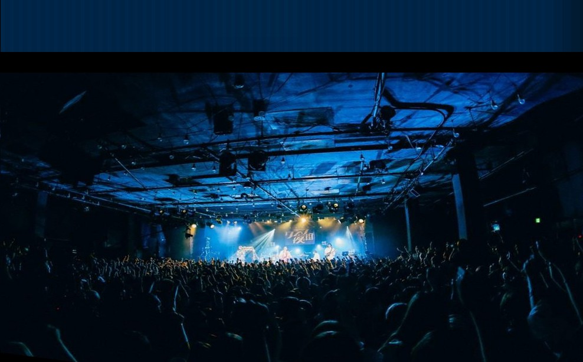

## Otimização de imagens

### 1) Converter imagens para WebP/AVIF
Use ferramentas como:
- Squoosh: https://squoosh.app/
- cwebp / avifenc

Exemplo de comando com cwebp:

```bash
cwebp -q 75 assets/hero.jpg -o assets/hero.webp
cwebp -q 75 assets/banda.jpg -o assets/banda.webp
```

Exemplo com AVIF:

```bash
avifenc -q 60 assets/hero.jpg assets/hero.avif
```

### 2) Aplicar no HTML com fallback

```html
<picture>
  <source srcset="assets/hero.avif" type="image/avif" />
  <source srcset="assets/hero.webp" type="image/webp" />
  
</picture>
```

### 3) Para imagens acima da dobra
Use `fetchpriority="high"` e `loading="eager"` quando necessário:

```html

```
